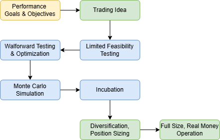

## **Table of Contents:**

- [**Strategy Development Main**](../README.md)
  - [Strategy_Factory Process](./strategy_factory.md)
  - [**Our Process**](./README.md)
    - [Idea Generation & Signal Identification](./identify_signals.md)
    - [Combine Signals Into Strategies](./strategies.md)
    - [Initial Feasibility Testing](./feasibility_testing.md)
    - [Rigorous Testing & Validation](./rigorous_test.md)
    - [Incubation](./incubation.md)
    - [Strategy Framework Integration](./Strategy_Framework.md)
    - [Money Management](./Money_Management.md)
    - [Portfolio Management](./Portfolio_Management.md)
    - [Strategy_Categories](./strategy_types.md)

---

# Kevin Davey's Strategy Factory Overview

Kevin Davy's Strategy Factory approach is a systematic, step-by-step procedure for creating, testing, and trading robust algorithmic trading strategies, with the ultimate objective of building a diversified “factory” of strategies to trade live.

Successful algorithmic trading strategies emerge from a well-defined, step-by-step process, not from one-off “lightbulb” ideas.
   - This process is designed to repeatedly generate and test strategies, akin to a “factory” pipeline.

---

---

The following is an outline of Kevin's Strategy Factory approach.

## 1 Goals and Objectives
- **Establish clear, realistic targets.** Kevin emphasizes developing “SMART” goals (Specific, Measurable, Attainable, Relevant, Time-bound) for each trading system. For instance, a trader might aim for a certain annual return/drawdown ratio over a given period. 
- **Create a Wish List.** Beyond strict requirements, traders should list secondary preferences (e.g., “low trades per day,” “only trade overnight,” “must include stop loss,” etc.). These help guide the rest of the strategy design.  
- **Avoid “impossible” goals.** For example, insisting on a 100% win rate or zero drawdown invariably leads to overfitting or unrealistic strategies.

## 2. Trading Idea

- **Gather many potential ideas.** According to Kevin, “It takes approx 100-200 trading ideas to yield 1 tradable system.” Ideas can come from published articles, books, data-mining, personal observations, seasonality concepts, etc.  
- **No pre-judging.** One core principle is testing every idea objectively. Even seemingly “silly” ideas should be tested, because some of Kevin’s best-performing strategies started from unorthodox concepts.  
- **Simplify when possible.** Many of his examples use simple entry triggers (e.g., price crossing a moving average, an overbought/oversold indicator, or a daily pattern) combined with straightforward exits.

## 3. Limited Feasibility Testing

- **Initial quick check.** Once an idea is coded, do a short, simple “sandbox” test to see if it has any merit. Typically, Kevin recommends a small test sample—often about 1-2 years—just to see if results are positive or at least not disastrous.  
- **Minimal complexity.** Keep the initial version of the strategy as basic as possible (1–2 indicators, simple stops) so you can quickly judge “worthwhile or not?”  
- **If unpromising, discard.** The point is to avoid over-optimizing an inherently poor idea. If it looks hopeless in the first pass, move on to the next idea.

## 4. Walkforward Testing and Optimization

- **In-depth, multi-window process.** Unlike a simple in-sample/out-of-sample optimization, Kevin uses multiple walkforward windows. For example, test 504 days in-sample, then 126 days out-of-sample, rolling forward repeatedly.  
- **Simplicity rules.** Although many traders rely on advanced fitness functions (e.g., Sharpe, MAR), Kevin often defaults to net profit or a similarly straightforward metric. He warns against overfitting advanced fitness metrics (like Return/DD or Sharpe) that can lead to “perfect” historical curves but poor live performance.  
- **Check trade count and distribution.** He emphasizes having a sufficient number of trades (e.g., at least 30–50 trades per in-sample window) to ensure that results aren’t just random luck.  
- **Look Inside Bar Testing (Intraday).** For intraday systems, Kevin stresses controlling how the backtester simulates price movement within the bar. Misuse of “Look Inside Bar” or “Intrabar Order Generation” can yield unrealistic equity curves.

## 5. Monte Carlo Simulation

- **Assess realistic risk.** Because historical max drawdown can be exceeded in live trading, Kevin runs Monte Carlo analysis on the final walkforward equity or the individual trades. This helps quantify worst-case drawdowns and probabilities.  
- **Use it for “stop trading” thresholds.** The simulation can identify high-risk drawdown levels where Kevin would quit a system. For example, “If the system hits 1.5× its historical max drawdown, I’ll stop trading it.”  
- **Require Return/DD > 2.0** (or similar). As part of acceptance criteria, Kevin usually wants a robust Return/DD ratio from the Monte Carlo runs. If the ratio is poor, or if ruin probability is too high, he discards the strategy.

## 6. Stress Testing & Additional Validation
- **Parameter Sensitivity**  
  - Tweak strategy parameters (e.g., moving average lengths, RSI periods) to see if the edge remains.  
  - Stable performance across a reasonable parameter range indicates stronger robustness.  
- **Vary Market Conditions**  
  - Test the strategy in different volatility regimes, bull/bear markets, or across multiple instruments.  
  - Ensures the strategy doesn’t rely solely on one narrow market environment.

## 7. Incubation

- **Paper trade or track forward.** After a strategy passes all testing, Kevin recommends 6–9 months of “live observation”—not in a real-money account, but monitoring results day by day. He calls this “incubation.”  
- **Detect overfit or broken logic.** If the system collapses in these months, it likely was a fluke. This approach prevents prematurely committing capital.  
- **Do not continuously tweak.** Kevin warns about “tweak-itis”—constantly adjusting the code whenever a losing streak happens. This short-circuits the incubation. The best approach is “hands off” after final testing.

## 8. Diversification, Position Sizing

- **Combine multiple strategies.** A key principle is that no single strategy can endure all market regimes. Therefore, Davey strongly suggests building multiple, uncorrelated systems across different markets (e.g., equities, metals, energies, rates).  
- **Portfolio perspective.** He uses correlation analysis and Monte Carlo with combined equity streams to see how systems blend. This often reduces drawdowns and increases risk-adjusted returns.  
- **Keep it simple for position sizing.** For example, a “fixed fractional” approach or “X contracts per $Y of capital.” He warns that advanced sizing can complicate the system and is usually best tested carefully.

## 9. Full-Size, Real-Money Operation

- **“Go Live” after Incubation.** Once a strategy has finished its 6–9 month forward test and still looks stable, Kevin suggests trading it for real but often starting at 1 contract (or minimal share size) to confirm it in real conditions.  
- **Track monthly performance.** He advocates comparing real-time performance to backtested (and walkforward) expectations to see if the strategy is still “in line.”  
- **Have a “quit plan.”** If the system or market changes drastically, or if the strategy hits a pre-specified risk threshold (e.g., a new worst-ever drawdown), shut the system down. Kevin highlights the importance of writing these rules down ahead of time, then following them.

## Additional Core Principles

- **Build a “factory” of strategies.** Instead of searching for one “Holy Grail,” the point is to have multiple robust systems in “inventory.” If one fails in live trading, simply drop it and replace it with another from the factory.  
- **Expect to discard most ideas.** Only a small fraction of raw trading ideas pass each development step. Kevin’s rule of thumb is 100+ ideas produce perhaps 1 worthy final system.  
- **Minimize complexity.** He cautions traders not to rely on too many parameters or hyper-optimized indicators, because these lead to overfitting.  
- **Be realistic about returns.** Citing real-world funds and CTA performance, Kevin shows that typical annual returns of 20–40% with moderate drawdowns are already better than many institutional traders. “Unrealistic” demands (e.g., 100% annual return, 5% max drawdown) lead to curve-fitted solutions that fail.  
- **Incorporate Monte Carlo and Real-Time “Incubation.”** These two steps are critical to catching over-optimized strategies before they do serious damage with real capital.  
- **Focus on process.** Kevin emphasizes that consistent methodology—rather than ad-hoc rules—prepares traders to adapt quickly and systematically, especially when a strategy’s edge vanishes.

## Summary of the Strategy Factory Approach

Kevin’s Strategy Factory is fundamentally a workflow for generating, testing, and deploying algo trading systems:
1. **Define Goals/Objectives** – Clarify performance targets and constraints.
2. **Generate Ideas** – Seek many possible entries, exits, filters, and “concept seeds.”
3. **Initial Feasibility Test** – Quickly discard weak ideas with minimal data checks.
4. **Walkforward Optimization** – Rigorously test with rolling in/out-of-sample windows.
5. **Run Monte Carlo** – Assess potential drawdowns, ruin risk, and returns distribution.
6. **Incubate** – Forward-test in real-time (paper or watch mode) for ~6–9 months.
7. **Diversify & Size** – Combine multiple uncorrelated strategies; pick position sizing.
8. **Live Trading** – Monitor performance monthly; have a plan to drop or re-check failing systems.

Overall, this rigorous, structured approach is designed to produce robust, rule-based trading systems that can weather different market regimes and reduce the risk of overfitting. Traders who follow it carefully typically develop a “pipeline” or “factory” of strategies—constantly testing new systems and incubating them, while weeding out those that fail in real-time.  